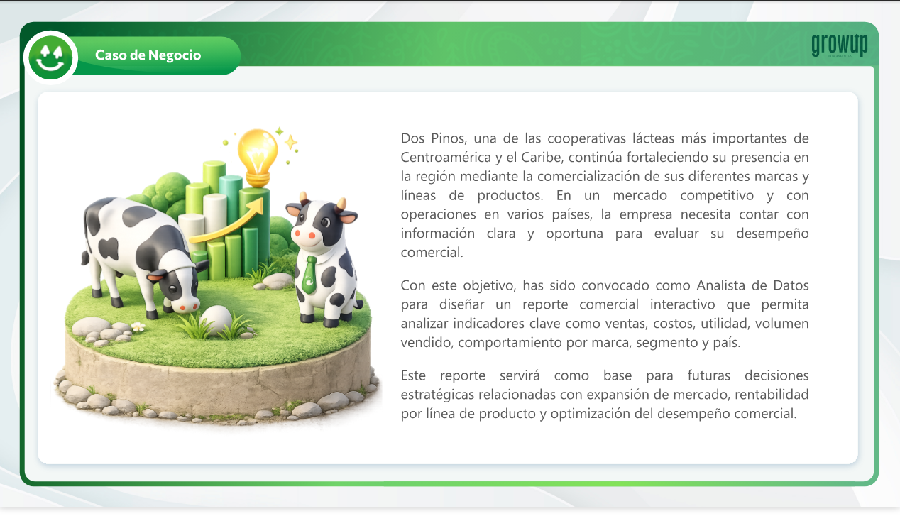
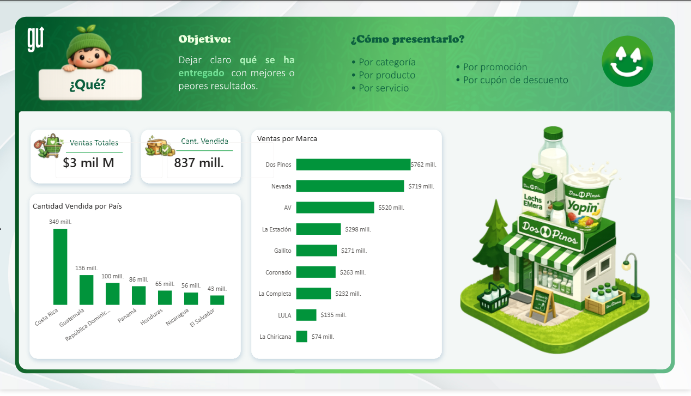

# 📊 Data Analytics - Caso de Estudio Dos Pinos

[](https://github.com/GJMachado)
[](https://www.python.org/)
[](https://powerbi.microsoft.com/)
[](LICENSE)

---

## 🎯 Descripción del Proyecto

Este proyecto realiza un **análisis integral de datos** sobre los datos para poder determinar los indicadores de ventas, costos, utilidades, volumenes vendidos, comportamientos de marca, segmento de mercado y pais
El objetivo principal es atravez de un ejercicio hipotetico desarrollar las habilidades necesarias para la utilizacion de las herramientas de analisis de datos.
Ejercicio tomado de la academia Grow UP en insercion de analisis de datos.

---

## 📋 Tabla de Contenidos

- [Características](#características)
- [Requisitos](#requisitos)
- [Instalación](#instalación)
- [Uso](#uso)
- [Visualizaciones](#visualizaciones)
- [Tecnologías](#tecnologías)
- [Resultados](#resultados)
- [Contribuciones](#contribuciones)
- [Autor](#autor)
- [Licencia](#licencia)

---

## ✨ Características

✅ Dashboard interactivo en Power BI  
✅ Análisis exploratorio de datos (EDA)  
✅ Visualizaciones claras y profesionales  
✅ Fácil de adaptar a nuevos datos  

---

---

## 🔧 Requisitos

### Para Power BI:
- Microsoft Power BI Desktop (última versión)
- Windows 10 o superior


---

## 📥 Instalación

### Paso 1: Clonar el repositorio
```bash
git clone https://github.com/GJMachado/Data-Analytics_-Study_DosPinos.git

```

### Paso 2: Abrir el reporte en Power BI
1. Abre Power BI Desktop
2. Selecciona "Abrir archivo"
3. Navega a `DosPinos_Dashboards.pbix`
4. ¡Listo! Explora los dashboards

---

## 🚀 Uso

### Visualizar el Dashboard
```
1. Abre Power BI Desktop
2. Carga el archivo: DosPinos_Dashboards.pbix
3. Usa los filtros interactivos para explorar los datos
4. Descarga las gráficas si lo necesitas
```


## 🖼️ Visualizaciones

### Dashboard Principal en Power BI



*El caso de estudio interactivo muestra:*
- 📈 Diseño de Dashboards interactivos para control de KPIs
- 🗺️ Manejo de datos para exponerlos
- 📊 Formatos de presentacion y manejo de datos

### Gráficos Principales




---

## 📹 Videos Tutoriales

### Video Introductorio
[](./Videos/video_introductorio.mp4)

### Explicación del Dashboard QUE?
[](./Videos/Dashboard_QUE.mp4)

### Update del Dashboard QUE?
[](./Videos/Update_Dashboard_QUE.mp4)

---

## 🛠️ Tecnologías Utilizadas

| Tecnología | Versión | Uso |
|-----------|---------|-----|
| **Power BI** | Última | Visualización e interactividad |
| **Power Query** || Procesamiento de datos |
| **Excell** | |Manipulación de datos |
| **Excell** | |Cálculos numéricos |
| **Power BI** | |Gráficos estáticos |
| **Power BI**| |Visualizaciones estadísticas |

---

## 📊 Datos y Fuentes


### Fuentes de Datos
- Agradecimiento especial a GROW UP Data Analytics (https:www.growupcr.com/)


### Recomendaciones

✅ Clonar el repositorio. 
✅ Correr el archivo y familiarizarse con él.  
✅ Adaptar su propia versión a sus neccesidades especifícas.  

---

## 🔄 Flujo de Trabajo

```
┌──────────────────┐
│   Datos Crudos   │
└────────┬─────────┘
         │
         ▼
┌──────────────────────┐
│  Limpieza y Validación│ 
└────────┬─────────────┘
         │
         ▼
┌──────────────────────┐
│  Análisis Exploratorio│ (Excell/Power BI)
└────────┬─────────────┘
         │
         ▼
┌��─────────────────────┐
│   Visualización      │ (Power BI)
└────────┬─────────────┘
         │
         ▼
┌──────────────────────┐
│   Insights/Reportes  │
└──────────────────────┘
```

---

## 🤝 Contribuciones

¡Las contribuciones son bienvenidas! Si deseas mejorar este proyecto:

1. Fork el repositorio
2. Crea una rama para tu feature (`git checkout -b feature/mejora`)
3. Commits de tus cambios (`git commit -m 'Agrega mejora'`)
4. Push a la rama (`git push origin feature/mejora`)
5. Abre un Pull Request

### Áreas de mejora
- Agregar más fuentes de datos
- Mejorar visualizaciones
- Optimizar scripts de análisis
- Traducir documentación

---

## 🐛 Reportar Problemas

Si encuentras algún bug o problema:

1. Abre una [Issue](https://github.com/GJMachado/Data-Analytics_-Study_DosPinos/issues)
2. Describe el problema en detalle
3. Incluye pasos para reproducirlo
4. Adjunta capturas de pantalla si es necesario

---


## 🎓 Aprendizajes

Este proyecto demuestra:
- ✅ Limpieza y transformación de datos
- ✅ Análisis exploratorio de datos (ETL)
- ✅ Visualización de datos interactiva
- ✅ Buenas prácticas en documentación

---

## 📞 Contacto

- **GitHub**: [@GJMachado](https://github.com/GJMachado)
- **Email**: [machado3178@gmail.com]
- **LinkedIn**: [tu-perfil](https://linkedin.com/in/machado31)

---

## 📄 Licencia

Este proyecto está bajo la Licencia MIT - ver el archivo [LICENSE](LICENSE) para más detalles.

```
MIT License

Copyright (c) 2026 GJMachado

Permission is hereby granted, free of charge, to any person obtaining a copy
of this software and associated documentation files (the "Software"), to deal
in the Software without restriction, including without limitation the rights
to use, copy, modify, merge, publish, distribute, sublicense, and/or sell
copies of the Software, and to permit to whom the Software is furnished to do
so, subject to the following conditions:
...
```

---

## ⭐ Si te fue útil, ¡no olvides dar una estrella!

```
        ⭐ Star ⭐ Fork ⭐ Follow ⭐
```

---

**Última actualización**: 25 de Febrero de 2026  
**Versión**: 1.0.0
